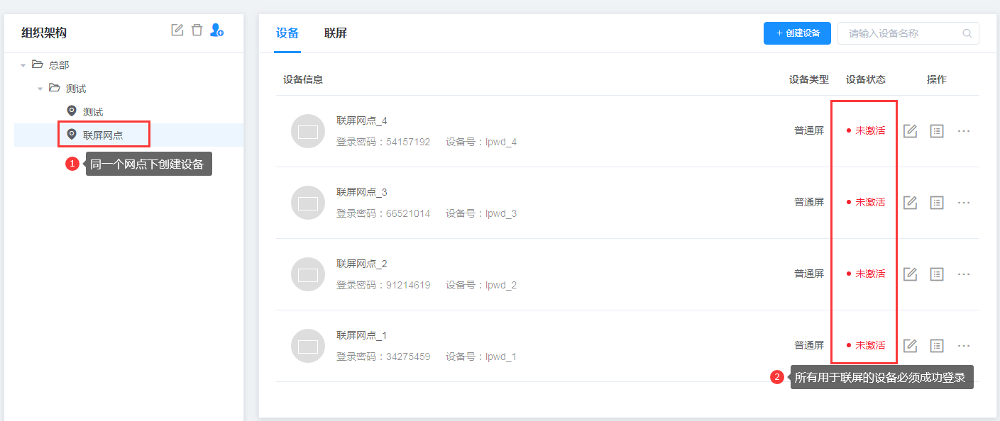
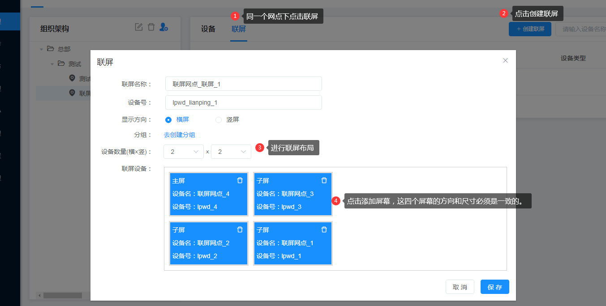
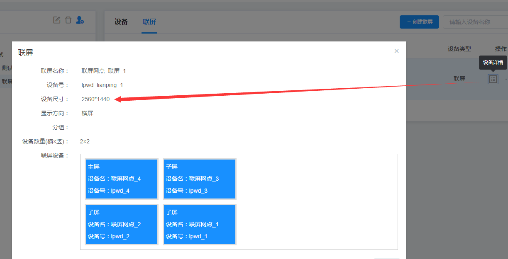
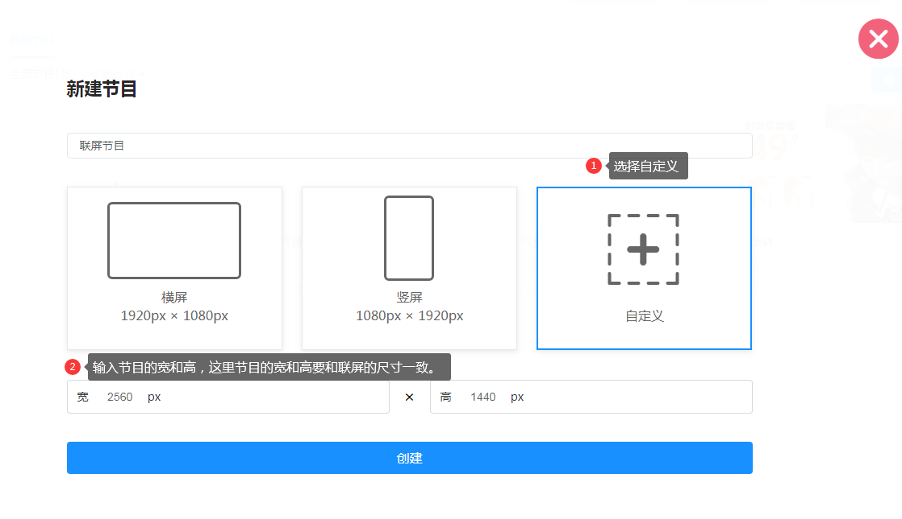
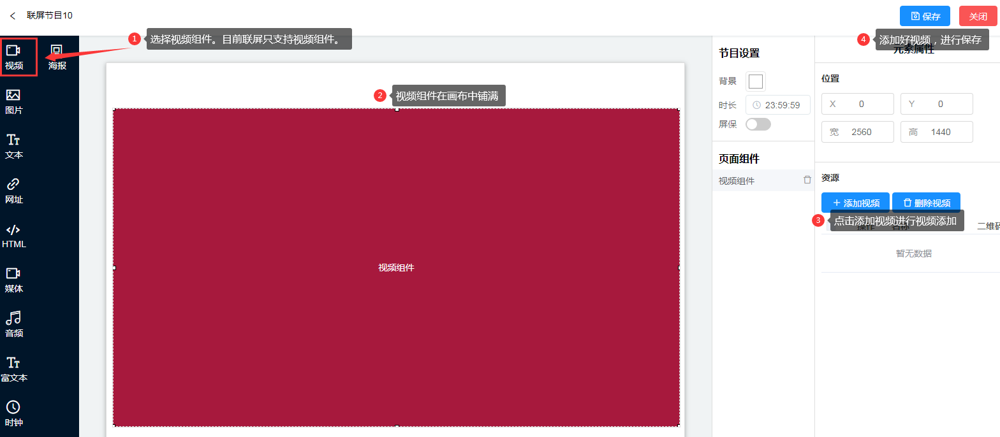
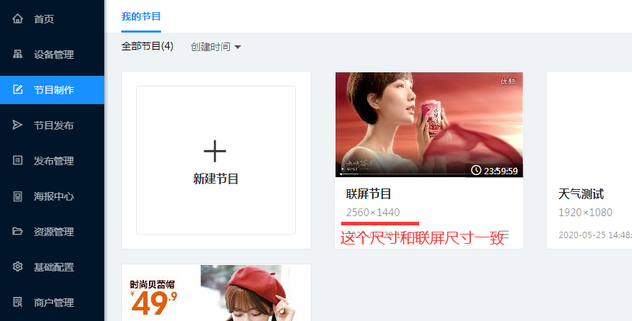
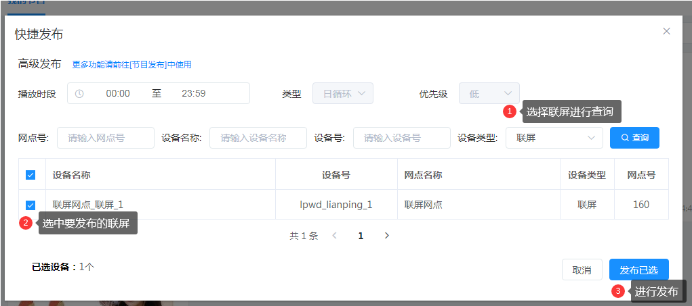

# 联屏使用指南

## 创建联屏
### 创建设备
同一个网点下，创建多个设备，并成功登录设备。设备的方向、尺寸要保持一致。
如：都是横屏，分辨率都是1280*720。

### 创建联屏
同一个网点下，点击联屏，点击创建联屏。进行联屏布局，然后添加已登录屏幕。并进行保存。

### 查看联屏尺寸
点击设备详情，查看设备尺寸

## 制作联屏节目
### 新建节目
点击左侧菜单节目制作>点击新建节目，弹出框中选择自定义，节目尺寸一定要和联屏尺寸保持一致。

### 添加视频
选择视频组件，然后全屏铺满，添加视频资源，进行保存。联屏功能只支持视频组件。

## 发布联屏节目

### 检查节目尺寸

### 发布节目
鼠移到要发布的节目上，点击快捷发布。
弹出框中，设备类型勾选联屏，进行查询。选择要发布的联屏，点击发布已选。
发布后，根据视频大小，系统会处理一段时间。如10MB的视频，需要5分钟。
