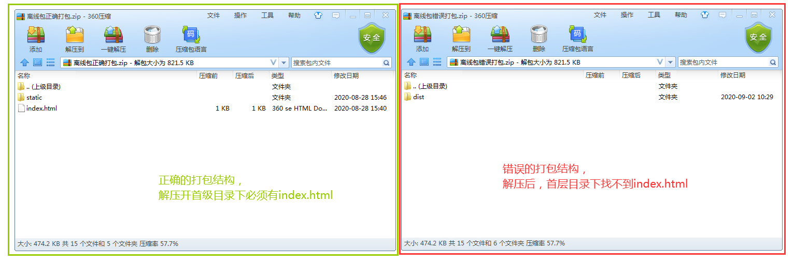
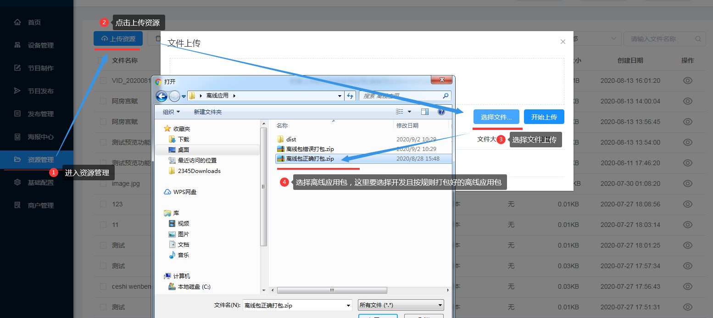
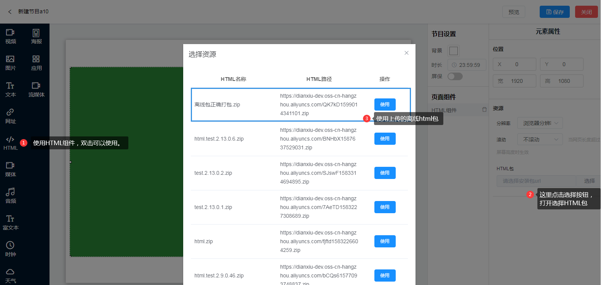

# 离线应用

## 离线包打包规则
1. 解压后首层目录下必须有index. html文件。作为访问的主要入口页面。
2. 其他目录文件无限制
示例：https://s.pointshow.net/mkt/a/demo.zip

## 商户平台中使用 
### 离线应用上传
1. 进入左侧菜单资源管理
2. 点击按钮上传资源
3. 选择按照打包规则打包好的离线html包
4. 点击按钮开始上传

### 使用离线应用
1. 进入左侧菜单节目制作
2. 点击新建节目
3. 新开页面中，双击或者拖拽左侧的HTML组件进行添加使用
4. 添加HTML组件后，页面右侧资源下的HTML包，点击选择
5. 弹出框中选择已上传的离线应用包进行使用。
